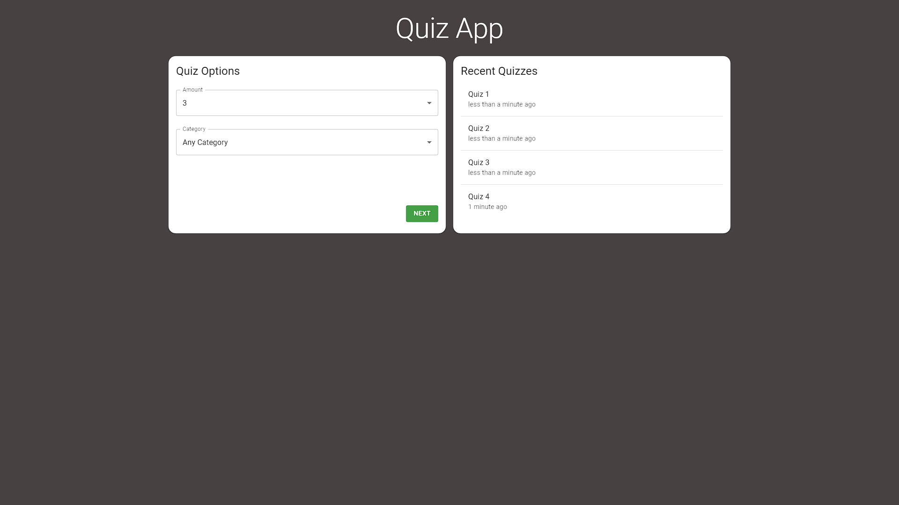

# Quiz App
Teste seus conhecimentos gerais com um pequeno quiz.

Para começar, selecione a quantidade de perguntas e a categoria. Faça o quiz. E veja o resultado.

Não se decepicione com o resultado, isso apenas significa que você tem muito espaço para aprender coisas novas.



## Instalação
Instalar dependências
```sh
cd quiz-app
npm install
```
Executar aplicação no navegador
```sh
npm run start
```